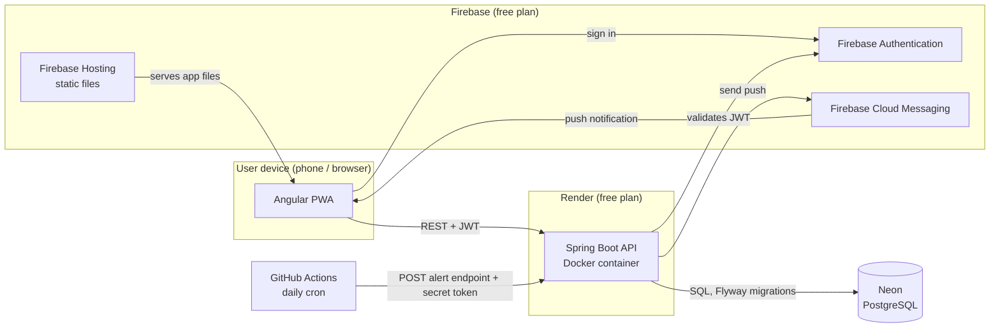

# Apotheca

[](https://github.com/LeonardoHenriqueTubero/apotheca/actions/workflows/backend-ci.yml)
[](https://github.com/LeonardoHenriqueTubero/apotheca/actions/workflows/frontend-ci.yml)
[](LICENSE)

**Know which medicines you have at home, how much is left, where they are and when they expire.**

🇧🇷 [Leia em português](README.pt-BR.md)

## The problem

At home there are many medicines and no control over them. People think they still have a
medicine when they don't, or keep boxes that expired years ago. Apotheca is a web app,
installable on phones as a PWA, that keeps a household's medicine inventory in one place and
warns before something runs out or expires.

> Apotheca only tracks stock. It is **not** a medical product and never recommends doses or
> treatments.

## Project status

🚧 **Early development.** The foundations are in place; the features are being built.

- [x] Monorepo with Spring Boot API, Angular app and local PostgreSQL (Docker Compose)
- [x] CI with GitHub Actions for backend and frontend
- [x] Architecture and main design decisions documented (ADRs below)
- [ ] Database schema (ER diagram + first Flyway migration)
- [ ] Sign-in with Firebase Authentication
- [ ] First deploy (Firebase Hosting, Render, Neon)
- [ ] Medicines, batches and stock movements
- [ ] Expiry and low-stock alerts via push notifications

## Planned features (MVP)

- Register medicines and each box bought (batch), with expiry date, quantity and storage location
- Status for every medicine: **expired**, **expires within 30 days**, **low stock**,
  always shown with icon and text, never color alone
- Effective expiry: the earlier of the printed date and the shelf life after opening
  (syrups, eye drops)
- Record usage, which keeps a stock movement history instead of overwriting quantities
- Shared households (family, friends' homes) joined through a single-use invite link
- Push alerts with a frequency chosen by each user (off, daily, weekly)

## Architecture



Details: [docs/diagrams/architecture.md](docs/diagrams/architecture.md). Database schema: [docs/diagrams/er.md](docs/diagrams/er.md).

## Tech stack

| Area | Technology |
|---|---|
| Frontend | Angular (standalone components, signals), Angular Material 3, PWA |
| Backend | Java 21, Spring Boot 4, Maven, MapStruct, springdoc-openapi (Swagger UI) |
| Database | PostgreSQL, Flyway migrations |
| Auth and push | Firebase Authentication, Firebase Cloud Messaging |
| Tests | JUnit, Testcontainers (real PostgreSQL), Vitest |
| Infrastructure | Docker, GitHub Actions (CI and scheduled alerts), Firebase Hosting, Render, Neon |

Everything runs on free plans.

## Engineering decisions

Every significant decision is recorded as an Architecture Decision Record (ADR), with the
context, the alternatives considered and the trade-offs.

| ADR | Decision |
|---|---|
| [0001](docs/decisions/0001-backend-package-structure-and-entity-dto-modeling.md) | Backend package-by-layer; DTOs as records, MapStruct, limited Lombok on entities |
| [0002](docs/decisions/0002-frontend-folder-structure-routing-and-state.md) | Frontend organized by feature, lazy-loaded routes, state in services with signals |
| [0003](docs/decisions/0003-ui-component-library.md) | Angular Material (Material 3) as the component library |
| [0004](docs/decisions/0004-continuous-integration-and-frontend-linting.md) | One CI workflow per app, filtered by path; ESLint on the frontend |
| [0005](docs/decisions/0005-visual-identity.md) | Visual identity: calm teal palette, accessible status colors, dark mode |
| [0006](docs/decisions/0006-household-invite-flow.md) | Household invites through single-use links that expire in 24 hours |
| [0007](docs/decisions/0007-low-stock-definition.md) | Low stock as an optional per-medicine minimum |
| [0008](docs/decisions/0008-push-tokens-and-alert-rules.md) | Push device tokens and user-chosen alert frequency |
| [0009](docs/decisions/0009-git-workflow-and-license.md) | Short-lived branches, pull requests, Conventional Commits, MIT license |
| [0010](docs/decisions/0010-date-and-time-handling.md) | Dates as `LocalDate`, instants in UTC, "today" in São Paulo time via an injected `Clock` |
| [0011](docs/decisions/0011-data-model-conventions.md) | Data model conventions: `BIGINT` ids, per-household data, hard delete, typed stock movements |

## Running locally

Prerequisites: **Java 21**, **Node.js 24**, **Docker**. Maven is not needed: the project uses the
Maven Wrapper (`./mvnw`).

```bash
# Database (PostgreSQL 17)
docker compose up -d

# API: http://localhost:8080 (Swagger UI at /swagger-ui.html)
cd backend
./mvnw spring-boot:run

# Web app: http://localhost:4200 (in another terminal)
cd frontend
npm install
npm start
```

Run the tests with `./mvnw verify` (backend) and `npx ng test --watch=false` (frontend).

## License

[MIT](LICENSE)
