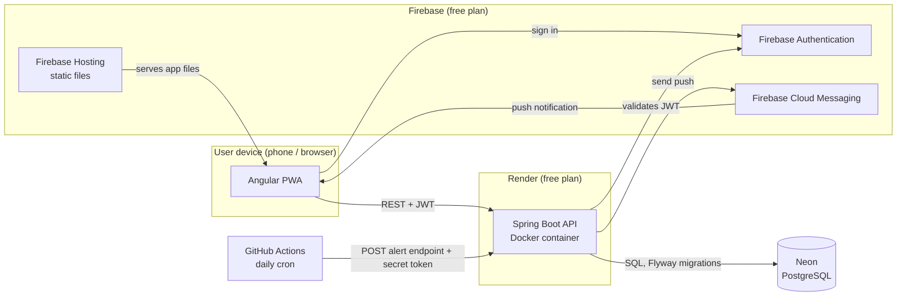

# Apotheca

[](https://github.com/LeonardoHenriqueTubero/apotheca/actions/workflows/backend-ci.yml)
[](https://github.com/LeonardoHenriqueTubero/apotheca/actions/workflows/frontend-ci.yml)
[](LICENSE)

**Saiba quais remédios você tem em casa, quanto sobrou, onde estão e quando vencem.**

🇺🇸 [Read in English](README.md)

## O problema

Em casa há muitos remédios e nenhum controle. A gente acha que ainda tem um remédio e não tem,
ou guarda caixas vencidas há anos. O Apotheca é um aplicativo web, instalável no celular como
PWA, que reúne o estoque de remédios da casa num só lugar e avisa antes que algo acabe ou vença.

> O Apotheca só controla estoque. Ele **não** é um produto médico e nunca recomenda doses ou
> tratamentos.

## Status do projeto

🚧 **Em desenvolvimento inicial.** A base está pronta; as funcionalidades estão sendo construídas.

- [x] Monorepo com API Spring Boot, app Angular e PostgreSQL local (Docker Compose)
- [x] CI com GitHub Actions para backend e frontend
- [x] Arquitetura e principais decisões de projeto documentadas (ADRs abaixo)
- [x] Esquema do banco (diagrama ER + primeira migration Flyway)
- [x] Login com Firebase Authentication
- [x] Primeiro deploy (Firebase Hosting, Render, Neon)
- [ ] Remédios, lotes e movimentações de estoque
- [ ] Alertas de validade e estoque baixo por notificação push

## Funcionalidades planejadas (MVP)

- Cadastrar remédios e cada caixa comprada (lote), com validade, quantidade e local de armazenamento
- Status de cada remédio: **vencido**, **vence em até 30 dias**, **estoque baixo**,
  sempre com ícone e texto, nunca só com cor
- Validade efetiva: a mais próxima entre a data impressa e o prazo após aberto
  (xaropes, colírios)
- Registrar o uso, que guarda um histórico de movimentações em vez de sobrescrever a quantidade
- Casas compartilhadas (família, casa de amigos), com entrada por link de convite de uso único
- Alertas push com frequência escolhida por cada usuário (desligado, diário, semanal)

## Arquitetura



Detalhes (em inglês): [docs/diagrams/architecture.md](docs/diagrams/architecture.md). Esquema do banco: [docs/diagrams/er.md](docs/diagrams/er.md).

## Tecnologias

| Área | Tecnologia |
|---|---|
| Frontend | Angular (standalone components, signals), Angular Material 3, PWA |
| Backend | Java 21, Spring Boot 4, Maven, MapStruct, springdoc-openapi (Swagger UI) |
| Banco de dados | PostgreSQL, migrations com Flyway |
| Login e push | Firebase Authentication, Firebase Cloud Messaging |
| Testes | JUnit, Testcontainers (PostgreSQL real), Vitest |
| Infraestrutura | Docker, GitHub Actions (CI e alertas agendados), Firebase Hosting, Render, Neon |

Tudo roda em planos gratuitos.

## Decisões de engenharia

Cada decisão importante está registrada como um Architecture Decision Record (ADR, em inglês),
com o contexto, as alternativas consideradas e os prós e contras.

| ADR | Decisão |
|---|---|
| [0001](docs/decisions/0001-backend-package-structure-and-entity-dto-modeling.md) | Backend organizado por camada; DTOs como records, MapStruct, Lombok limitado nas entidades |
| [0002](docs/decisions/0002-frontend-folder-structure-routing-and-state.md) | Frontend organizado por funcionalidade, rotas lazy, estado em services com signals |
| [0003](docs/decisions/0003-ui-component-library.md) | Angular Material (Material 3) como biblioteca de componentes |
| [0004](docs/decisions/0004-continuous-integration-and-frontend-linting.md) | Um workflow de CI por app, filtrado por caminho; ESLint no frontend |
| [0005](docs/decisions/0005-visual-identity.md) | Identidade visual: paleta teal calma, cores de status acessíveis, modo escuro |
| [0006](docs/decisions/0006-household-invite-flow.md) | Convites para a casa por link de uso único que expira em 24 horas |
| [0007](docs/decisions/0007-low-stock-definition.md) | Estoque baixo como mínimo opcional por remédio |
| [0008](docs/decisions/0008-push-tokens-and-alert-rules.md) | Tokens de dispositivo para push e frequência de alerta escolhida pelo usuário |
| [0009](docs/decisions/0009-git-workflow-and-license.md) | Branches curtas, pull requests, Conventional Commits, licença MIT |
| [0010](docs/decisions/0010-date-and-time-handling.md) | Datas como `LocalDate`, instantes em UTC, "hoje" no fuso de São Paulo via `Clock` injetado |
| [0011](docs/decisions/0011-data-model-conventions.md) | Convenções do modelo de dados: ids `BIGINT`, dados por casa, exclusão real, movimentações tipadas |
| [0012](docs/decisions/0012-authentication-with-firebase.md) | Autenticação: tokens do Firebase conferidos pelo Spring Security, tudo protegido por padrão, login com Google |
| [0013](docs/decisions/0013-api-deployment-on-render.md) | Deploy da API: imagem Docker multi-stage no Render (Virgínia, perto do Neon), publicada só depois do CI passar |
| [0014](docs/decisions/0014-api-design-and-error-format.md) | Desenho da API: rotas dentro da casa, 404 para quem não é membro, erros no padrão RFC 9457, services Angular escritos à mão |
| [0015](docs/decisions/0015-batch-status-and-stock-movements.md) | Estoque muda só por uso, descarte e ajuste; o primeiro uso abre a caixa; caixas usadas até o fim ficam `EMPTY` |

## Como rodar localmente

Pré-requisitos: **Java 21**, **Node.js 24**, **Docker**. Não é preciso instalar o Maven: o projeto
usa o Maven Wrapper (`./mvnw`).

```bash
# Banco de dados (PostgreSQL 17)
docker compose up -d

# API: http://localhost:8080 (Swagger UI em /swagger-ui.html)
cd backend
./mvnw spring-boot:run

# App web: http://localhost:4200 (em outro terminal)
cd frontend
npm install
npm start
```

Rode os testes com `./mvnw verify` (backend, precisa do Docker rodando por causa do Testcontainers) e
`npx ng test --watch=false` (frontend).

## Licença

[MIT](LICENSE)
