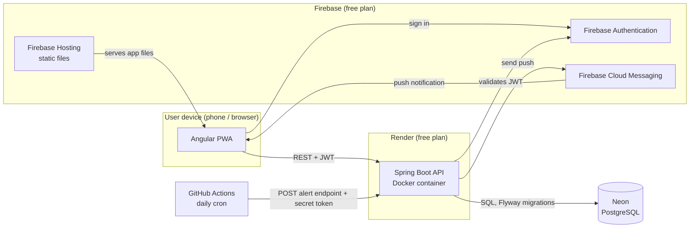

# Apotheca

Gerenciador de estoque de medicamentos de casa: saiba quais remédios a sua família tem, quanto sobrou, onde estão guardados e quando vencem. Aplicativo web e PWA instalável.

> Em construção.

## Arquitetura

Detalhes (em inglês): [docs/diagrams/architecture.md](docs/diagrams/architecture.md).
