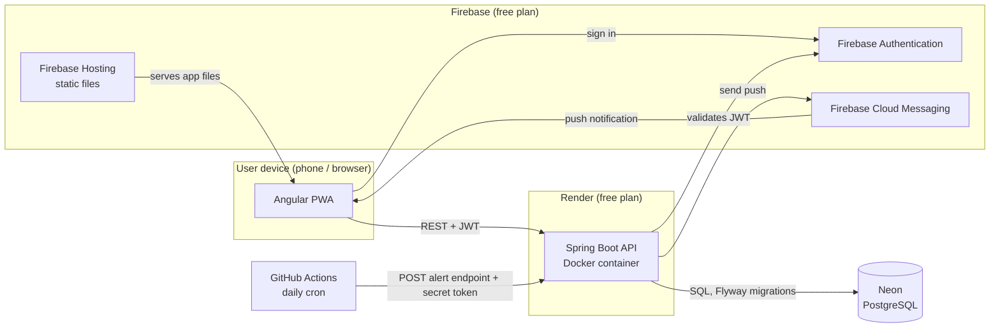

# Architecture

How the pieces of Apotheca run in production. Every service is on a free plan (decision #1).

## What each arrow means

| Arrow | Explanation |
|---|---|
| Hosting → PWA | Firebase Hosting only serves static files (HTML, JS, CSS). The app runs in the user's browser, installed as a PWA on phones. Hosting has no Java runtime, so the API lives elsewhere (decision #5). |
| PWA → Firebase Authentication | Users sign in with Firebase; the app never sees or stores passwords (decision #4). |
| PWA → API | The browser calls the REST API and sends the Firebase JWT in the `Authorization` header. |
| API → Firebase Authentication | Spring Security (resource server) checks that the JWT was signed by Firebase. |
| API → Neon | Data lives in PostgreSQL on Neon. The schema changes only through Flyway migrations (decision #14). |
| Cron → API | A GitHub Actions workflow runs once a day and calls the alert endpoint, protected by a secret token. An in-process `@Scheduled` job would not run while the free Render instance is asleep (decision #8, ADR 0008). |
| API → FCM → PWA | When a user's alert is due and there is something to report, the API asks Firebase Cloud Messaging to deliver a push notification to their devices. On iOS this only works when the PWA is installed. |

The API runs as a Docker container (decision #7), so the same image can later move to
Google Cloud Run. The free Render instance sleeps when idle, and the first request after
that takes about a minute; the UI shows a "waking up the server" state.
