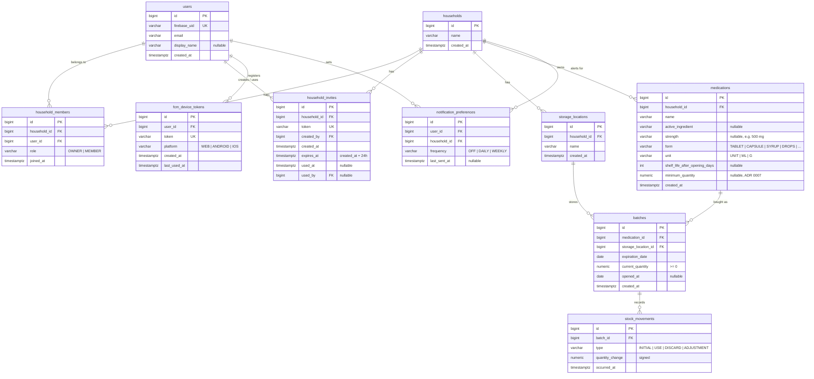

# ER diagram

The database schema of Apotheca, implemented by the Flyway migrations in
`backend/src/main/resources/db/migration/`. Conventions (ids, enums, quantities,
deletion) are in [ADR 0011](../decisions/0011-data-model-conventions.md); date and time
types in [ADR 0010](../decisions/0010-date-and-time-handling.md).

## Notes

- **Unique pairs:** `household_members (household_id, user_id)`,
  `notification_preferences (user_id, household_id)`,
  `storage_locations (household_id, name)`.
- **Deletion:** deleting a household removes everything inside it; deleting a
  medication removes its batches and movements (`ON DELETE CASCADE`). A storage
  location that still holds batches cannot be deleted (`ON DELETE RESTRICT`); move
  the batches first. `household_invites.used_by` becomes `NULL` if that user is deleted.
- **Invariant:** for every batch, `sum(stock_movements.quantity_change) = current_quantity`.
  Creating a batch writes an `INITIAL` movement.
- **Privacy (LGPD):** `stock_movements` has no user column, on purpose: the app does
  not record *who* took a medicine.
